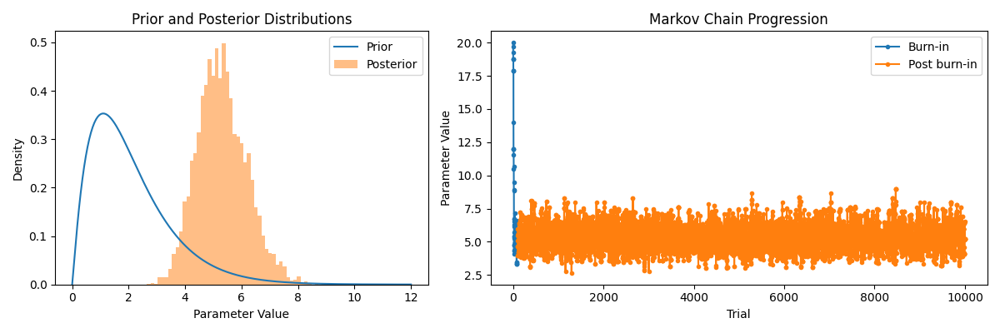
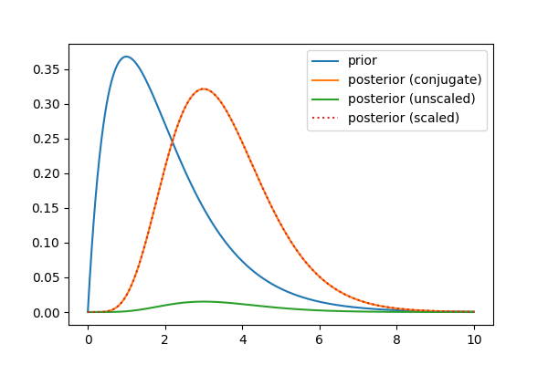
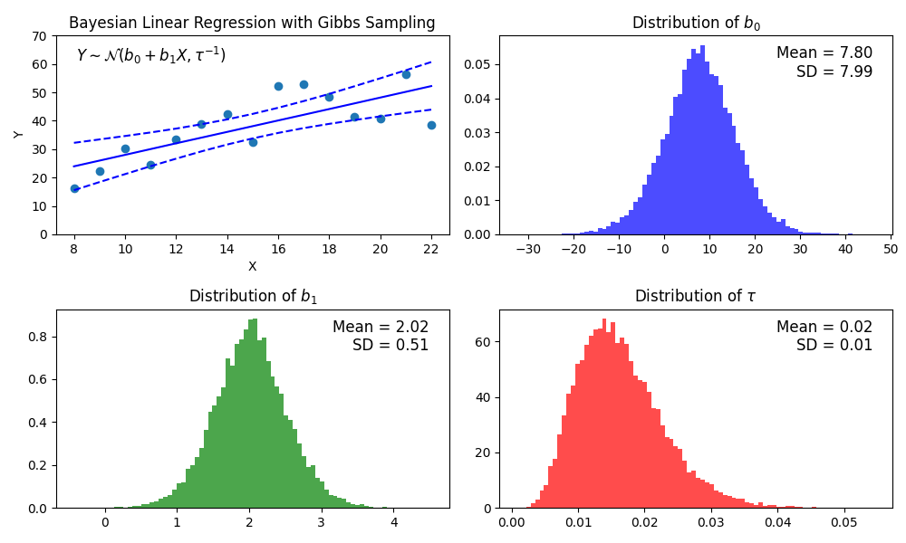
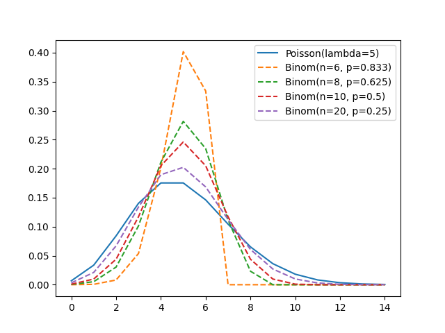

# Introduction to Bayesian Statistics

## Overview

This repository contains a collection of simple Python scripts I wrote while reading:

- Donovan, Therese, and Ruth M. Mickey, *Bayesian Statistics for Beginners: a step-by-step approach* (Oxford, 2019)

They helped me make sense of some of the concepts discussed.

## Repository Contents

### `MCMC_metropolis.py`
An implementation of single parameter Bayesian inference using the Metropolis algorithm.

### `num_integration`
Demonstrates that simple Bayesian inference problems can be solved using regular numerical integration instead of MCMC methods. (The book jumps straight to MCMC.)

### `bayesian_regression.py`
An implementation of Bayesian regression using Gibbs sampling.

### `poisson.py`
Illustrates how the Binomial approximates a Poisson as **n** increases, keeping **p*n** constant.

